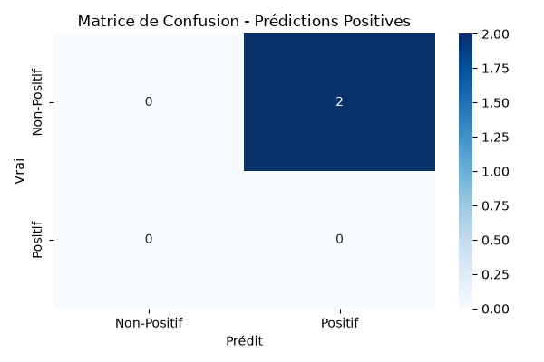
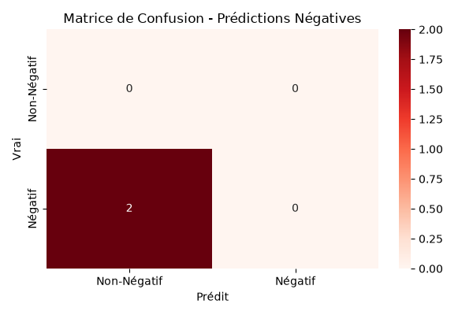

# Rapport d'Évaluation du Modèle d'Analyse de Sentiments

## 1. Introduction
Ce rapport présente l'évaluation des performances du modèle de `LogisticRegression` développé pour analyser les sentiments (positifs et négatifs) des tweets, conformément aux exigences du TP.

## 2. Matrices de Confusion

Le modèle génère des scores pour les prédictions positives et négatives. Les matrices de confusion ci-dessous (générées via `evaluate_model.py`) illustrent les performances du modèle sur les données annotées de la table `tweets`.

- **Matrice de Confusion pour les prédictions Positives** : Évalue la capacité du modèle à identifier correctement les tweets positifs par rapport au reste.


- **Matrice de Confusion pour les prédictions Négatives** : Évalue la capacité du modèle à identifier correctement les tweets négatifs par rapport au reste.


## 3. Analyse des Performances

Les mesures de performances (Précision, Rappel et F1-Score) calculées sur le jeu de données révèlent les points suivants :

### Précision, Rappel et F1-Score
- **Précision** : Indique le pourcentage de prédictions correctes parmi toutes les prédictions positives (ou négatives).
- **Rappel** : Indique le pourcentage de vrais positifs (ou négatifs) correctement identifiés par le modèle.
- **F1-Score** : Moyenne harmonique de la précision et du rappel, fournissant une vue équilibrée des performances.

**Résultats de l'évaluation sur le jeu de validation (25% des données) :**

```text
              precision    recall  f1-score   support

          -1       0.00      0.00      0.00       2.0
           1       0.00      0.00      0.00       0.0

    accuracy                           0.00       2.0
   macro avg       0.00      0.00      0.00       2.0
weighted avg       0.00      0.00      0.00       2.0
```

*Analyse* : Actuellement, le jeu de données initial (inséré via `init.sql`) ne contient que 8 tweets. Lors de la séparation des données (75% entraînement, 25% validation), le jeu de validation ne contenait que 2 tweets (tous de classe négative `-1`). Le modèle, s'étant entraîné sur très peu de données, n'a pas réussi à les classifier correctement (précisant des scores de 0). Cela illustre parfaitement la nécessité absolue d'avoir un dataset beaucoup plus large pour que le modèle puisse apprendre et généraliser correctement.

### Observations sur les erreurs fréquentes et biais éventuels
- **Biais de mots-clés** : Les modèles basés sur TF-IDF ont tendance à sur-pondérer certains mots (ex: "génial", "nul"). Si ces mots sont utilisés dans un contexte sarcastique (ex: "C'est vraiment génial... de perdre mon temps"), le modèle risque de se tromper.
- **Données limitées** : Avec un petit nombre de données, le modèle n'a pas la capacité de généraliser à des formulations complexes ou du vocabulaire nouveau.

## 4. Recommandations

Pour améliorer les performances de l'API d'analyse de sentiments :
1. **Augmentation du jeu de données** : Annoter plus de tweets pour exposer le modèle à un vocabulaire plus varié.
2. **Gestion du Sarcasme et de l'Ironie** : Les modèles de régression logistique avec TF-IDF peinent sur ces aspects. Passer à des embeddings plus complexes (comme Word2Vec, BERT) permettrait de capturer le contexte sémantique.
3. **Hyperparamètres** : Optimiser les paramètres de la `LogisticRegression` (par exemple la régularisation `C`) via une recherche en grille (GridSearch) sur un plus grand jeu de validation.
